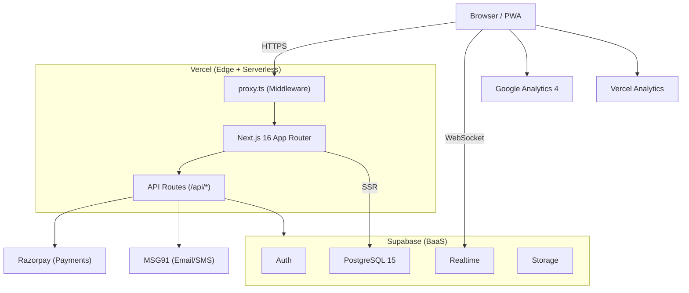
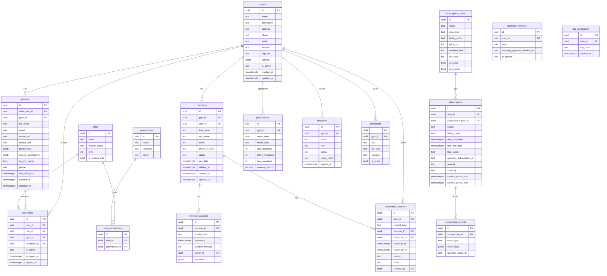
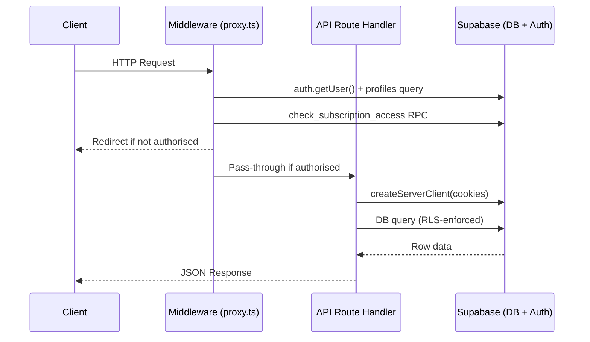
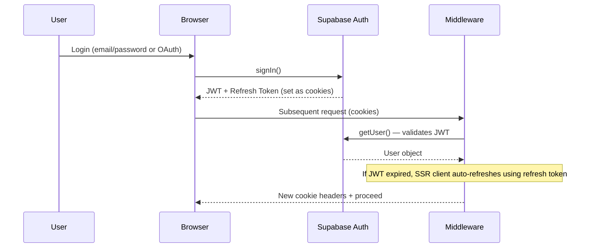
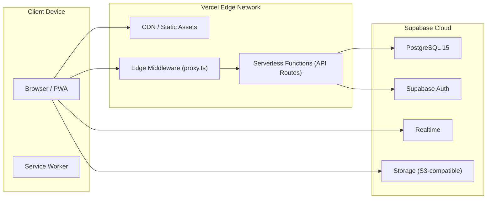
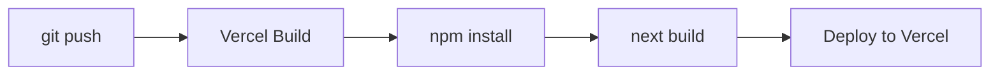

# Centric Fit — Architecture Documentation

> **Source of Truth** — Derived entirely from actual implementation. Updated: 2026-06-24.

---

## Table of Contents

1. [Executive Summary](#1-executive-summary)
2. [System Overview](#2-system-overview)
3. [Technology Stack](#3-technology-stack)
4. [Repository Structure](#4-repository-structure)
5. [Frontend Architecture](#5-frontend-architecture)
6. [Backend Architecture](#6-backend-architecture)
7. [Database Architecture](#7-database-architecture)
8. [API Architecture](#8-api-architecture)
9. [Authentication & Authorization](#9-authentication--authorization)
10. [Third-Party Integrations](#10-third-party-integrations)
11. [Infrastructure Architecture](#11-infrastructure-architecture)
12. [CI/CD Architecture](#12-cicd-architecture)
13. [Security Architecture](#13-security-architecture)
14. [Observability](#14-observability)
15. [Performance Architecture](#15-performance-architecture)
16. [Progressive Web App (PWA)](#16-progressive-web-app-pwa)
17. [Development Workflow](#17-development-workflow)
18. [Architectural Decisions](#18-architectural-decisions)
19. [Technical Debt](#19-technical-debt)
20. [Architecture Changelog](#20-architecture-changelog)

---

## 1. Executive Summary

**Application name:** Centric Fit  
**Domain:** `centric.fit`  
**npm package name:** `centric-fit`

Centric Fit is a multi-tenant SaaS fitness management platform targeting gyms, studios, and fitness centres in India. It provides two distinct user experiences from a single codebase:

- **Gym Admin App** — for gym owners, managers, and trainers to manage members, attendance, analytics, staff, subscriptions, and settings.
- **Member Portal** — a simplified member-facing view for check-in history and personal profile management.

**Business goals:**
- 14-day free trial with paid subscription tiers (Starter / Professional / Enterprise).
- India-first market with INR payments via Razorpay.
- Mobile-first PWA so gym staff can use it without an app-store install.

**Core capabilities:**
- Member lifecycle management (add / edit / remove / import CSV / bulk operations).
- Attendance tracking (check-in / check-out for members and staff).
- Analytics dashboard (growth, revenue, retention, activity trends).
- Role-Based Access Control (RBAC) with 4 roles: `owner`, `manager`, `trainer`, `member`.
- Invitation system with email delivery (MSG91).
- Subscription billing (Razorpay, with trial management).
- Real-time data sync via Supabase Realtime.
- Offline-capable PWA with service worker caching.

---

## 2. System Overview

### High-Level Architecture



### Architectural Style

- **Monorepo** — single Next.js application.
- **Full-stack Next.js** — RSC + App Router with server components, server actions, and API route handlers.
- **BaaS-first** — Supabase handles auth, database, realtime, and storage. No separate backend service.
- **Multi-tenant** — tenant isolation enforced at the database level via Row Level Security (RLS) scoped to `gym_id`.

### Core Domains

| Domain | Purpose |
|--------|---------|
| Auth | Sign-up, sign-in, session, invitation acceptance |
| Gym | Gym entity, settings, onboarding |
| Members | Member CRUD, status, CSV import, portal |
| RBAC | Roles, permissions, user-role assignments |
| Attendance | Session-based check-in/out for members and staff |
| Analytics | Aggregated metrics, charts, reporting |
| Subscriptions | Plans, trials, billing, payment events |
| Invitations | Token-based invitations with email delivery |
| Staff | Staff directory, management |

---

## 3. Technology Stack

### Frontend

| Technology | Version | Purpose | Location |
|-----------|---------|---------|---------|
| Next.js | ^16.1.1 | Full-stack React framework (App Router) | `src/app/` |
| React | ^19.2.3 | UI rendering | throughout |
| TypeScript | ^5 | Type safety | throughout |
| TailwindCSS | ^4 | Utility-first styling | `tailwind.config.ts`, `globals.css` |
| shadcn/ui | N/A (component registry) | Pre-built accessible UI components | `src/components/ui/` |
| Radix UI | Various ^1–^2 | Headless primitives for shadcn components | `src/components/ui/` |
| Framer Motion | ^12.23.12 | Sidebar/navigation animations | `src/app/(app)/client-layout.tsx`, portal layout |
| Lucide React | ^0.525.0 | Icon set | throughout |
| Recharts | ^3.2.1 | Data visualisation charts | `src/components/charts/` |
| @tremor/react | ^3.18.7 | Additional chart/card components | `src/components/analytics/` |
| date-fns | ^4.1.0 | Date formatting and manipulation | hooks, components |
| react-hook-form | ^7.60.0 | Form state management | form components |
| zod | ^3.25.74 | Runtime schema validation | forms, API routes |
| @hookform/resolvers | ^5.1.1 | Zod resolver for react-hook-form | forms |
| next-themes | ^0.4.6 | Dark/light theme switching with 5 colour themes | `src/components/providers/theme-provider.tsx` |
| sonner | ^2.0.5 | Toast notifications | `src/components/ui/sonner.tsx` |
| zustand | ^5.0.6 | Lightweight client state management | `src/stores/` |
| papaparse | ^5.5.3 | CSV parsing for member imports | `src/lib/member-csv.ts` |
| react-advanced-cropper | ^0.20.1 | Avatar/image cropping | settings components |
| react-calendly | ^4.4.0 | Embed Calendly booking widget | landing page / demo |
| react-day-picker | ^9.8.1 | Date picker UI | form components |

### Backend (API Routes)

| Technology | Version | Purpose | Location |
|-----------|---------|---------|---------|
| Next.js API Routes | ^16.1.1 | Serverless endpoint handlers | `src/app/api/` |
| @supabase/ssr | ^0.8.0 | Server-side Supabase client with cookie handling | `src/utils/supabase/server.ts` |
| @supabase/supabase-js | ^2.44.4 | Supabase JS client | `src/utils/supabase/client.ts` |
| razorpay (npm) | ^2.9.6 | Server-side Razorpay SDK | `src/services/payment.service.ts` |
| zod | ^3.25.74 | Request body validation | API route handlers |

### Database

| Technology | Version | Purpose |
|-----------|---------|---------|
| PostgreSQL | 15 (via Supabase) | Primary relational database |
| Supabase | Cloud | Managed Postgres + Auth + Realtime + Storage |
| Row Level Security | N/A | Tenant data isolation at the DB level |

### Authentication

| Technology | Purpose |
|-----------|---------|
| Supabase Auth | Primary auth provider (email/password, Google OAuth) |
| @supabase/ssr | Server-side session management via cookies |
| JWT | Token standard, 1-hour expiry with rotation |

### Infrastructure & Hosting

| Technology | Purpose |
|-----------|---------|
| Vercel | Hosting, Edge Middleware, CDN, serverless functions |
| Supabase Cloud | Managed DB, Auth, Realtime, Storage |

### Analytics & Monitoring

| Technology | Purpose |
|-----------|---------|
| @vercel/analytics | Page view and performance analytics |
| Google Analytics 4 (`G-V3R593B626`) | User behaviour tracking |
| MSG91 Hello Widget | In-app support chat widget |

### Payments

| Technology | Purpose |
|-----------|---------|
| Razorpay | INR payment processing, subscription billing, webhooks |

### Email / Messaging

| Technology | Purpose |
|-----------|---------|
| MSG91 | Transactional email delivery via template API; also SMS capability |

---

## 4. Repository Structure

```
gym-saas-mvp/
├── architecture.md              ← this file
├── package.json                 ← dependencies (npm)
├── next.config.ts               ← Next.js config (headers, image domains)
├── vercel.json                  ← Vercel build config
├── tailwind.config.ts           ← Tailwind theme
├── components.json              ← shadcn/ui registry config
├── tsconfig.json                ← TypeScript config
├── eslint.config.mjs            ← ESLint config
├── .env.local                   ← Local secrets (not committed)
├── public/                      ← Static assets
│   ├── sw.js                    ← Service worker
│   ├── manifest.ts → /manifest  ← PWA manifest (dynamic route)
│   ├── icon-*.png               ← PWA icons
│   ├── og-image.png             ← Open Graph image
│   └── robots.txt               ← Crawler instructions
├── supabase/                    ← Supabase local dev config
│   ├── config.toml              ← Local Supabase configuration
│   ├── seed.sql                 ← Database seed data
│   └── migrations/              ← 39 ordered SQL migration files
├── src/
│   ├── proxy.ts                 ← Next.js Middleware (route guard)
│   ├── app/                     ← Next.js App Router pages
│   │   ├── layout.tsx           ← Root layout (providers, analytics)
│   │   ├── page.tsx             ← Marketing landing page
│   │   ├── manifest.ts          ← Dynamic PWA manifest route
│   │   ├── sitemap.ts           ← Dynamic sitemap
│   │   ├── (app)/               ← Gym admin route group
│   │   │   ├── client-layout.tsx  ← Admin sidebar/nav layout
│   │   │   ├── dashboard/
│   │   │   ├── analytics/
│   │   │   ├── attendance/
│   │   │   ├── members/
│   │   │   ├── staff/
│   │   │   ├── team/
│   │   │   ├── settings/
│   │   │   └── upgrade/
│   │   ├── (auth)/              ← Auth route group
│   │   │   ├── login/
│   │   │   ├── signup/
│   │   │   └── verify-email/
│   │   ├── (portal)/            ← Member portal route group
│   │   │   └── portal/
│   │   │       ├── page.tsx     ← Member dashboard
│   │   │       ├── history/     ← Attendance history
│   │   │       └── profile/     ← Member profile
│   │   ├── api/                 ← Next.js API route handlers
│   │   │   ├── analytics/
│   │   │   ├── attendance/
│   │   │   ├── auth/
│   │   │   ├── auth-check/
│   │   │   ├── communications/
│   │   │   ├── documents/
│   │   │   ├── email/
│   │   │   ├── gyms/
│   │   │   ├── health/
│   │   │   ├── invites/
│   │   │   ├── members/
│   │   │   ├── payment-methods/
│   │   │   ├── payments/
│   │   │   ├── rbac/
│   │   │   ├── staff/
│   │   │   ├── subscriptions/
│   │   │   └── webhooks/razorpay/
│   │   ├── onboarding/          ← Gym setup wizard
│   │   ├── accept-invite/       ← Invitation acceptance flow
│   │   ├── inactive-user/       ← Deactivated account page
│   │   ├── offline/             ← Offline fallback page (PWA)
│   │   ├── contact/
│   │   ├── privacy-policy/
│   │   ├── terms-of-service/
│   │   └── refund-policy/
│   ├── actions/                 ← Next.js Server Actions
│   │   ├── auth.actions.ts      ← Sign-up, sign-in, OTP, password reset
│   │   ├── invite.actions.ts    ← Invitation acceptance
│   │   └── rbac.actions.ts      ← Role & permission mutations
│   ├── components/
│   │   ├── ui/                  ← shadcn/ui base components (34)
│   │   ├── providers/           ← React context providers
│   │   ├── layout/              ← Sidebar, nav, user section
│   │   ├── auth/                ← AuthGuard, login forms
│   │   ├── members/             ← Member management UI
│   │   ├── analytics/           ← Analytics charts/cards
│   │   ├── attendance/          ← Attendance UI
│   │   ├── charts/              ← Recharts wrappers
│   │   ├── dashboard/           ← Dashboard widgets
│   │   ├── invites/             ← Invitation management
│   │   ├── payments/            ← Payment/subscription UI
│   │   ├── pwa/                 ← PWA install prompt, service worker
│   │   ├── rbac/                ← Permission-guarded wrappers
│   │   ├── settings/            ← Gym settings forms
│   │   ├── subscriptions/       ← Plan selection, management
│   │   ├── support/             ← HelloWidget support chat
│   │   ├── trial/               ← Trial banner and countdown
│   │   ├── landing/             ← Marketing landing page sections
│   │   ├── legal/               ← Privacy/ToS content
│   │   └── onboarding/          ← Onboarding wizard steps
│   ├── hooks/                   ← Custom React hooks (21)
│   ├── lib/                     ← Shared utilities and services (24)
│   ├── services/                ← Business logic services
│   │   ├── member.service.ts    ← Member CRUD business logic
│   │   └── payment.service.ts   ← Razorpay payment business logic
│   ├── stores/                  ← Zustand state stores
│   │   ├── ui-store.ts          ← Sidebar collapse state, UI flags
│   │   ├── toast-store.ts       ← Global toast/notification state
│   │   └── settings-store.ts    ← User preferences
│   ├── types/                   ← TypeScript type definitions
│   │   ├── supabase.ts          ← Auto-generated Supabase DB types
│   │   ├── rbac.types.ts        ← RBAC role/permission types
│   │   ├── invite.types.ts      ← Invitation types
│   │   ├── member.types.ts      ← Member entity types
│   │   └── pwa.ts               ← PWA install prompt types
│   └── utils/
│       └── supabase/
│           ├── client.ts        ← Browser Supabase client factory
│           └── server.ts        ← Server Supabase client factory (cookie-based)
```

---

## 5. Frontend Architecture

### Routing

The application uses **Next.js App Router** with three route groups:

| Route Group | Path Prefix | Purpose |
|-------------|-------------|---------|
| `(app)` | `/dashboard`, `/analytics`, `/attendance`, `/members`, `/staff`, `/team`, `/settings`, `/upgrade` | Gym admin interface |
| `(auth)` | `/login`, `/signup`, `/verify-email` | Authentication pages |
| `(portal)` | `/portal`, `/portal/history`, `/portal/profile` | Member self-service portal |
| Root routes | `/`, `/onboarding`, `/accept-invite`, `/contact`, `/privacy-policy`, `/terms-of-service`, `/refund-policy`, `/offline` | Public and utility pages |

**Middleware route guard** (`src/proxy.ts`) runs before every request and enforces:
- Unauthenticated users → `/login`
- Authenticated users without a gym → `/onboarding`
- Members (`role === 'member'`) accessing app routes → `/portal`
- Inactive/removed users → `/inactive-user`
- Users without active subscription (and not on `/upgrade` or `/settings`) → `/upgrade`

### Layout Architecture

```
RootLayout (layout.tsx)
  └── ThemeProvider (5 colour themes + system)
       └── RazorpayProvider (loads Razorpay checkout.js)
            └── QueryProvider (TanStack Query)
                 └── SessionProvider (Supabase auth listener)
                      ├── SupabaseErrorHandler
                      ├── {children}
                      │    ├── ClientLayout [(app) group]
                      │    │    └── RequireAuth
                      │    │         └── RealtimeProvider
                      │    │              └── CollapsibleSidebar + main content
                      │    └── PortalLayout [(portal) group]
                      │         └── RealtimeProvider
                      │              └── PortalDataProvider
                      │                   └── CollapsibleSidebar + main content
                      ├── HelloWidgetWrapper (MSG91 support chat)
                      ├── PWAWrapper (install prompt)
                      ├── ServiceWorkerRegister
                      ├── Toaster (sonner)
                      └── Analytics (Vercel + GA4)
```

### State Management

| Store | Library | State |
|-------|---------|-------|
| `ui-store.ts` | Zustand | Sidebar expanded/collapsed (desktop + mobile) |
| `toast-store.ts` | Zustand | Global toast queue |
| `settings-store.ts` | Zustand | User UI preferences |
| Server state | TanStack Query | All async data (auth, members, gym, invites, payments…) |

### Component Hierarchy

- `src/components/ui/` — primitive shadcn/Radix components (Button, Dialog, Select, Table, etc.)
- `src/components/layout/` — `CollapsibleNavItem`, `SidebarToggle`, `CollapsibleUserSection`, `LoadingSpinner`
- `src/components/members/` — `MemberList`, `MemberForm`, `MemberCard`, bulk operations, CSV import
- `src/components/analytics/` — dashboard analytics cards and charts
- `src/components/charts/` — Recharts wrappers
- `src/components/payments/` — payment forms, subscription display
- `src/components/rbac/` — `PermissionGate` (renders children only when user has required permission)

### Data Fetching Strategy

All client-side async data goes through **TanStack Query v5** (`@tanstack/react-query`):
- Query client config lives in `src/lib/query-client.ts`.
- Per-resource custom hooks in `src/hooks/` encapsulate query keys, fetcher functions, and mutations.
- `staleTime` is set per-hook (auth session: 10 min; gym data: varies).
- A **circuit breaker** in `src/lib/query-optimizations.ts` caps query invalidation at 10/min per key to prevent infinite re-render loops.
- Optimistic updates are used on member and profile mutations.

### Form Handling

All forms use **react-hook-form** + **zod** resolvers (`@hookform/resolvers`). Validation schemas are co-located with forms or in `src/lib/` service files.

### Authentication Flow (Client)

1. `SessionProvider` subscribes to `supabase.auth.onAuthStateChange` once globally.
2. `useAuth()` hook queries `['auth-session']` via TanStack Query; fetches user + profile in one call.
3. On logout → `queryClient.clear()` + redirect to `/login`.
4. Corrupted cookie detection handles `Invalid UTF-8 sequence` errors gracefully (clears cookies, treats as unauthenticated).

### Error Handling

- `ErrorBoundary.tsx` — React error boundary wrapping page content.
- `SupabaseErrorHandler` provider — global handler for Supabase connection errors.
- Per-hook error returns are surfaced via sonner toasts.
- Offline page `/offline` served by the service worker as a navigation fallback.

### Performance Optimisations

- `useDeferredValue` on `pathname` in sidebar to avoid blocking navigation highlights.
- `Suspense` boundaries on all page `<main>` content.
- Image optimisation with AVIF + WebP via `next/image`, 1-year cache TTL.
- Dynamic imports in `src/lib/dynamic-imports.ts` for heavy components (charts, CSV parser).
- `refetchOnMount: false` on auth query (avoids redundant API call on every mount since middleware already validates session).

---

## 6. Backend Architecture

### API Routes (`src/app/api/`)

All routes are Next.js Route Handlers (serverless functions on Vercel). Each route creates a Supabase server client from cookies and uses RLS for tenant isolation.

| Route | Methods | Purpose |
|-------|---------|---------|
| `/api/analytics` | GET | Gym analytics aggregate data |
| `/api/attendance` | GET, POST | Attendance session listing |
| `/api/auth` | GET, POST | Auth callback / email update |
| `/api/auth-check` | GET | Session validity check |
| `/api/communications` | POST | Send communication to members |
| `/api/documents` | GET, POST, DELETE | Document management |
| `/api/email` | POST | Generic email send via MSG91 |
| `/api/gyms` | GET, POST, PUT | Gym CRUD |
| `/api/gyms/stats` | GET | Gym aggregate statistics |
| `/api/gyms/owner` | GET | Gym owner info |
| `/api/health` | GET | Health check (DB connectivity) |
| `/api/invites` | GET, POST | List and create invitations |
| `/api/invites/[invitationId]` | GET, PUT, DELETE | Single invitation management |
| `/api/invites/cleanup` | POST | Expire stale invitations |
| `/api/invites/resend` | POST | Resend invitation email |
| `/api/invites/verify` | POST | Verify invitation token |
| `/api/members` | GET, POST, PUT, DELETE | Member CRUD |
| `/api/members/bulk` | POST | Bulk member operations |
| `/api/members/attendance` | GET | Member attendance records |
| `/api/members/checkin` | POST | Check-in a member |
| `/api/members/checkout` | POST | Check-out a member |
| `/api/members/me` | GET | Authenticated member's own data |
| `/api/members/portal` | GET | Member portal data |
| `/api/members/status` | PUT | Update member status |
| `/api/payment-methods` | GET, POST, DELETE | Payment method management |
| `/api/payments` | GET, POST | Payment initiation and listing |
| `/api/payments/upgrade` | POST | Plan upgrade payment |
| `/api/payments/verify` | POST | Verify Razorpay payment signature |
| `/api/rbac` | GET, POST, PUT, DELETE | Role/permission management |
| `/api/staff` | GET, POST, PUT, DELETE | Staff directory |
| `/api/subscriptions` | GET, POST | Subscription management |
| `/api/webhooks/razorpay` | POST | Razorpay webhook handler (HMAC verified) |

### Server Actions (`src/actions/`)

| File | Purpose |
|------|---------|
| `auth.actions.ts` | Sign-up, sign-in, OTP verification, password reset, phone auth |
| `invite.actions.ts` | Invitation acceptance (creates user role, links member) |
| `rbac.actions.ts` | Assign/update/revoke roles; permission checks used by middleware and UI |

### Business Logic Services (`src/services/`)

| Service | Responsibilities |
|---------|-----------------|
| `member.service.ts` | Member validation, deduplication, soft-delete, status transitions |
| `payment.service.ts` | Razorpay instance lifecycle, order creation, signature verification, subscription management |

### Library Utilities (`src/lib/`)

| File | Purpose |
|------|---------|
| `invitation-service.ts` | Core invitation create/resend/verify logic with rate limiting |
| `email-service.ts` | Wrapper over MSG91 for email dispatch |
| `msg91.ts` | MSG91 API client (template + raw email, SMS) |
| `rbac-utils.ts` | Role hierarchy comparisons, permission checks, display helpers |
| `config.ts` | Env var validation, `clientConfig` and `serverConfig` objects |
| `logger.ts` | Structured logging (dev-friendly, production-safe) |
| `sanitization.ts` | Input sanitisation and rate limiting utilities |
| `query-client.ts` | TanStack Query client factory with defaults |
| `query-optimizations.ts` | Circuit breaker for query invalidation |
| `member-csv.ts` | CSV parsing and member import validation |
| `avatar-utils.ts` | Avatar URL resolution and fallback initials |
| `static-subscription-plans.ts` | Hard-coded plan data for landing page (no DB call needed) |
| `invite-utils.ts` | Token generation, hashing, and invite URL construction |

### Middleware (`src/proxy.ts`)

The file is named `proxy.ts` and exported as the Next.js middleware via a `config` matcher. It runs on the Edge runtime for every non-static request and implements the full authentication and authorisation gate:

1. Returns immediately for static files (bounded LRU cache of 500 entries).
2. Creates a Supabase SSR client with environment-prefixed cookies (`dev-`, `staging-`, `prod-`).
3. Fetches user auth session.
4. Fetches user profile + active role from `profiles` + `user_roles`.
5. Calls `check_subscription_access` RPC to enforce trial/plan expiry.
6. Redirects or allows based on route type and user state.
7. On any unexpected error: **fails open** (returns `NextResponse.next()`).

**Subscription access cache** — an in-process Map with 5-minute TTL provides a last-known-state fallback on DB errors (fail-open if no cached state exists).

---

## 7. Database Architecture

### Supabase Project

- **Project ID:** `sbwzxwludgylvpkurnsh`
- **Region:** (hosted on Supabase cloud)
- **PostgreSQL version:** 15

### Entity-Relationship Diagram



### Tables Summary

| Table | Row Count Expectation | Tenant-scoped by |
|-------|--------------------|-----------------|
| `gyms` | Low (one per tenant) | itself |
| `profiles` | One per user | `gym_id` |
| `roles` | 4 system roles | global |
| `permissions` | ~20 system permissions | global |
| `role_permissions` | Junction | global |
| `user_roles` | One per user per gym | `gym_id` |
| `members` | High (100s–1000s per gym) | `gym_id` |
| `member_activities` | Very high | via `members.gym_id` |
| `attendance_sessions` | Very high | `gym_id` |
| `subscription_plans` | Static (~6 rows) | global |
| `subscriptions` | One per gym owner | `user_id` |
| `payment_methods` | Low | `user_id` |
| `subscription_events` | Append-only audit log | via `subscription_id` |
| `gym_metrics` | Daily aggregate per gym | `gym_id` |
| `invitations` | Moderate | `gym_id` |
| `documents` | Moderate | `gym_id` |
| `otp_verifications` | Transient | `user_id` |

### Row Level Security

RLS is enabled on **all tables**. Policies use `SECURITY DEFINER` helper functions to avoid infinite recursion:

- `has_permission(user_uuid, gym_uuid, permission_name)` — checks role level.
- `get_user_role(user_uuid, gym_uuid)` — returns role name.
- `has_role_level(user_uuid, gym_uuid, required_level)` — numeric level check.
- `check_subscription_access(p_user_id)` — used by middleware for plan/trial gating.

### Database Functions (Key RPCs)

| Function | Purpose |
|----------|---------|
| `has_permission` | RBAC permission check for RLS policies |
| `get_user_role` | Role resolution for a user+gym pair |
| `get_user_permissions` | Full permission array for a user+gym |
| `has_role_level` | Numeric role level gate |
| `check_subscription_access` | Returns bool — active subscription OR valid trial |
| `get_member_attendance` | Paginated member attendance list |
| `get_staff_attendance` | Paginated staff attendance list |
| `start_attendance_session` | Creates or reuses an open session |
| `end_attendance_session` | Sets `check_out_at` on a session |

### Key Indexes

- `idx_members_gym_status` — `(gym_id, status)` composite for member list queries.
- `idx_user_roles_user_gym` — `(user_id, gym_id) WHERE is_active = true` — used on every auth check.
- `idx_attendance_sessions_gym_checkin` — `(gym_id, check_in_at DESC)` — attendance feed.
- `idx_subscriptions_active` — `(user_id, status) WHERE status = 'active'`.
- `idx_subscriptions_trial` — `(trial_status, trial_end_date)`.

### Migrations

39 migrations in `supabase/migrations/` numbered `01_` through `39_`. Key milestones:

| Range | Scope |
|-------|-------|
| 01–05 | Base schema: gyms, profiles, RBAC, members, subscriptions |
| 06–10 | Functions, triggers, policies, indexes, seed data, views |
| 11–13 | Attendance system |
| 14–16 | Invitation performance, member portal |
| 17–20 | Enhanced member management, policy fixes, subscription functions |
| 21–27 | Attendance policies, phone, storage, RLS iteration |
| 28–36 | Profile/member refactor (auth_user_id), RLS recursion fixes |
| 37–39 | Fitness logo storage, gym read for member role |

> **Note:** The `profiles.id` ↔ `auth.users.id` mapping went through a refactor (migrations 25–36). The codebase now supports both `auth_user_id.eq.${userId}` and `id.eq.${userId}` (dual-read pattern) during the transition period.

---

## 8. API Architecture

### Request Flow



### Authentication Requirements

All `/api/*` routes (except `/api/health`) require a valid Supabase session cookie. Routes create a server Supabase client from cookies and use `supabase.auth.getUser()` for session validation. Authorization is then enforced by RLS at the database layer.

### Response Format

API routes return standard `{ data, error }` JSON or plain objects. HTTP status codes are used semantically (200, 201, 400, 401, 403, 404, 500).

### Error Handling

API routes catch errors and return appropriate HTTP codes. Zod validation errors produce `400` with field-level detail. Supabase errors are forwarded with their messages. No error stack traces are returned to clients in production.

---

## 9. Authentication & Authorization

### Authentication Provider

**Supabase Auth** handles all authentication:
- Email / password signup with email verification.
- Google OAuth (configured in Supabase dashboard).
- OTP via phone (SMS through Twilio configured in `supabase/config.toml`).

### Session Management

- Sessions stored as **cookies** (not localStorage) using `@supabase/ssr`.
- Cookie names are environment-prefixed: `dev-sb-*`, `staging-sb-*`, `prod-sb-*`.
- JWT expiry: **1 hour** with refresh token rotation enabled (reuse interval: 10 seconds).
- The middleware re-issues updated cookie headers on every request to maintain session liveness.

### Token Flow



### User Roles and Levels

| Role | Level | Capabilities |
|------|-------|-------------|
| `owner` | 100 | Full access to all resources |
| `manager` | 75 | Members, analytics, attendance, read staff/gym |
| `trainer` | 60 | Read/update members, activities, own profile |
| `member` | 25 | Own profile, read own activities, read basic gym info |

Roles are stored in `user_roles` (gym-scoped, one role per user per gym). They are also denormalised into `profiles.default_role` for faster lookup.

### Permissions

21 named permissions in the format `resource.action`:
- `members.*` (create, read, update, delete)
- `analytics.*` (read, export)
- `gym.*` (create, read, update)
- `staff.*` (create, read, update, delete)
- `billing.*` (read, update)
- `activities.*` (create, read, update, delete)
- `profile.*` (read, update)

### Security Boundaries

- **Database level:** RLS ensures every query is automatically scoped to the user's gym.
- **Middleware level:** Route group access is enforced before the page renders.
- **Component level:** `PermissionGate` component renders children only if the user has the required permission.
- **API level:** Each route re-validates the session and relies on RLS for data isolation.

---

## 10. Third-Party Integrations

### Supabase

- **Purpose:** BaaS — managed PostgreSQL, Auth, Realtime WebSocket, File Storage.
- **Config:** `NEXT_PUBLIC_SUPABASE_URL`, `NEXT_PUBLIC_SUPABASE_ANON_KEY`.
- **Data exchanged:** All application data; JWT sessions; file uploads (gym logos, documents).
- **Failure handling:** Middleware fails open on DB errors; TanStack Query retries with exponential backoff; last-known-state caches for subscription access.
- **Security:** RLS on all tables; anon key is public (restricted by RLS); service role key never exposed to client.

### Razorpay

- **Purpose:** Payment processing and subscription billing (INR).
- **Config:** `RAZORPAY_KEY_ID`, `RAZORPAY_KEY_SECRET`, `RAZORPAY_WEBHOOK_SECRET`.
- **Data exchanged:** Payment orders, subscriptions, webhook events (payment success/failure).
- **Integration points:**
  - `src/services/payment.service.ts` — server-side order creation and signature verification.
  - `src/components/providers/razorpay-provider.tsx` — loads `checkout.js` script.
  - `/api/webhooks/razorpay` — receives and HMAC-verifies webhook events.
  - `/api/payments/verify` — verifies client-side payment completion.
- **Failure handling:** Payment failures stored as `subscription_events`; webhook verification prevents spoofing.
- **Security:** Key secret and webhook secret are server-only env vars. HMAC verification on all webhooks.

### MSG91

- **Purpose:** Transactional email delivery (invitation emails) and SMS OTP capability.
- **Config:** `MSG91_API_KEY`, `MSG91_EMAIL_DOMAIN`, `MSG91_BRAND_NAME`, `MSG91_INVITATION_TEMPLATE_ID`, `SYSTEM_FROM_EMAIL`.
- **Data exchanged:** Invitation email (recipient email, gym name, inviter name, role, invite URL).
- **Integration:** `src/lib/msg91.ts` → `src/lib/email-service.ts` → called from `InvitationService`.
- **Failure handling:** Email send errors are logged and surfaced as warnings; invitation is still created in DB.
- **Security:** API key is server-only.

### Google Analytics 4

- **Purpose:** User behaviour analytics (page views, events).
- **Config:** `NEXT_PUBLIC_GA_MEASUREMENT_ID` (`G-V3R593B626`).
- **Data exchanged:** Anonymous page paths, events.
- **Integration:** Inline `<Script>` tags in `src/app/layout.tsx`.
- **Consent:** Default analytics storage is `granted` (⚠️ see Technical Debt).

### Vercel Analytics

- **Purpose:** Core Web Vitals and performance monitoring.
- **Config:** Automatic on Vercel deployment.
- **Integration:** `<Analytics />` component from `@vercel/analytics/next`.

### MSG91 Hello Widget

- **Purpose:** In-app customer support chat.
- **Config:** `NEXT_PUBLIC_MSG91_HELLO_WIDGET_TOKEN` (`77f51`).
- **Integration:** `src/components/support/HelloWidgetWrapper.tsx`.

### Calendly

- **Purpose:** Demo booking widget on marketing page.
- **Config:** `NEXT_PUBLIC_CALENDLY_URL`.
- **Integration:** `react-calendly` component on landing page.

---

## 11. Infrastructure Architecture

### Hosting

| Service | Provider | Purpose |
|---------|----------|---------|
| Web application | Vercel | Next.js hosting, edge middleware, CDN |
| Database | Supabase Cloud | Managed PostgreSQL 15 |
| Auth | Supabase Cloud | Supabase Auth |
| Realtime | Supabase Cloud | WebSocket broadcast |
| File Storage | Supabase Storage | Gym logos, documents |

### Deployment Topology



### Environments

| Environment | `NODE_ENV` | `NEXT_PUBLIC_APP_ENV` | Cookie Prefix | App URL |
|------------|------------|----------------------|---------------|---------|
| Development | `development` | — | `dev-` | `http://localhost:3000` |
| Staging | `production` | `staging` | `staging-` | — |
| Production | `production` | `prod` (default) | `prod-` | `https://centric.fit` |

### Storage Buckets (Supabase)

- **`fitness_logos`** — gym logo images (migration 37). Public read via RLS policies (migration 39).

### Security Headers (next.config.ts)

Applied to all routes:
- `X-Frame-Options: DENY`
- `X-Content-Type-Options: nosniff`
- `Referrer-Policy: strict-origin-when-cross-origin`
- `X-XSS-Protection: 1; mode=block`
- `Strict-Transport-Security: max-age=63072000; includeSubDomains; preload`

> Content-Security-Policy is commented out and requires per-deployment tuning.

---

## 12. CI/CD Architecture

### Build Pipeline



- **Build command:** `npm run build`
- **Install command:** `npm install`
- **Output directory:** `.next`
- No GitHub Actions or other CI configuration was found. Vercel Git integration handles automatic deployments.

### Database Migrations

Migrations are managed manually via Supabase CLI:
```bash
npm run db:push    # Push local migrations to remote
npm run db:pull    # Pull remote schema changes
npm run db:diff    # Diff local vs remote schema
```

Type generation:
```bash
npm run types:supabase   # Regenerates src/types/supabase.ts from live schema
```

### Release Strategy

- Push to main branch → Vercel auto-deploys to production.
- No documented staging or feature-branch deployment strategy found.

### Rollback Strategy

- Vercel dashboard provides instant rollback to any previous deployment.
- Database rollback requires manual migration (no down migrations defined).

---

## 13. Security Architecture

### Authentication Protections

- Supabase JWT validation on every request (middleware + API routes).
- Cookie-based sessions (HttpOnly where set by Supabase SSR).
- Environment-prefixed cookie names prevent cross-environment session leakage.
- Corrupted cookie (invalid UTF-8) handling: clears cookies and treats as unauthenticated rather than crashing.

### Authorization Model

Three-layer defense:
1. **Middleware** — redirects unauthorised route access before any page renders.
2. **RLS** — every DB query is automatically restricted to the user's gym.
3. **Component** — `PermissionGate` prevents rendering of UI elements for unauthorised users.

### Secret Management

- All secrets stored in `.env.local` (not committed to git).
- Server-only secrets (Razorpay, MSG91) accessed only in API routes and server actions.
- `NEXT_PUBLIC_*` vars are intentionally public (Supabase anon key, GA ID).

### Input Validation & Sanitisation

- All API request bodies validated with **Zod** schemas.
- `src/lib/sanitization.ts` provides text sanitisation and rate-limiting utilities.
- Rate limiting applied in `InvitationService` to prevent invitation spam.

### Data Protection

- Soft-delete for members (`deleted_at` timestamp, migration 26/34).
- PII (email, phone) stored in `profiles` and `members`; not logged.

### Rate Limiting

- Auth rate limits configured in `supabase/config.toml` (30 sign-ins per 5 min, 2 emails/hour in dev).
- `InvitationService` has application-level rate limiting.
- Query invalidation circuit breaker prevents runaway re-renders.

### Known Security Risks

- ⚠️ **CSP disabled** — `Content-Security-Policy` header is commented out in `next.config.ts`.
- ⚠️ **GA4 consent** — Analytics storage consent defaults to `granted` without user opt-in.
- ⚠️ **Subscription cache fail-open** — If Supabase is down for >5 minutes with no cached state, users retain access regardless of subscription status.

---

## 14. Observability

### Logging

`src/lib/logger.ts` provides a structured logger:
- In development: verbose logs with context objects.
- Production: controlled output; avoids logging PII.
- Used throughout middleware, API routes, hooks, and services.

### Error Tracking

- No dedicated error tracking service (e.g., Sentry) was found in the codebase.
- React `ErrorBoundary` in `src/components/ErrorBoundary.tsx` catches rendering errors.
- `SupabaseErrorHandler` provider catches global Supabase connection errors.

### Monitoring

- **Vercel Analytics** — Core Web Vitals, real user performance.
- **Supabase Dashboard** — DB query performance, auth events, realtime connections.

### Health Check

`GET /api/health` — tests Supabase DB connectivity and returns system status.

---

## 15. Performance Architecture

### Caching

| Layer | Strategy | TTL |
|-------|----------|-----|
| TanStack Query (auth session) | Stale-while-revalidate | 10 min stale |
| TanStack Query (members list) | Varies per hook | — |
| Subscription access cache | In-process Map | 5 min |
| Static file detection cache | In-process Map (bounded 500) | Process lifetime |
| Next.js image cache | CDN | 1 year |
| Service worker static assets | Cache-first | `centric-fit-static-v2` cache |
| Service worker HTML pages | Network-first, cache fallback | `centric-fit-v2` cache |

### Database Performance

- Comprehensive index coverage on all frequently queried columns (see migration 08).
- Partial indexes (`WHERE is_active = true`, `WHERE status = 'active'`) reduce index size.
- `DATE()` function indexes avoided (unreliable); timestamp range queries used instead.
- Realtime subscriptions are channel-based (per gym_id) to limit broadcast scope.

### API Performance

- Supabase RPC functions (`get_member_attendance`, `get_staff_attendance`) use server-side pagination (`LIMIT`/`OFFSET`).
- `max_rows = 1000` configured in Supabase local config.

### Frontend Performance

- `useDeferredValue` on pathname for non-blocking navigation transitions.
- `Suspense` boundaries at page level.
- Dynamic imports for heavy components (charts, croppers).
- `refetchOnMount: false` on auth query.
- PWA caching reduces repeat-visit load times.

---

## 16. Progressive Web App (PWA)

### Manifest

Dynamic route at `/manifest` (`src/app/manifest.ts`) generates the Web App Manifest with:
- Name: "Centric Fit"
- Display mode: `standalone`
- Theme and background colours
- Icons: 192×192, 256×256, 512×512
- Shortcuts for quick navigation

### Service Worker

`public/sw.js` — manually written service worker (not next-pwa generated):
- **Install:** Caches static assets (`/`, icons, `/offline`).
- **Activate:** Deletes old caches.
- **Fetch strategy:**
  - HTML (text/html, RSC): **Network-first** → cache fallback → `/offline` for navigations.
  - Static assets (CSS, JS, images): **Cache-first** → network fallback.
  - Skips: API calls, Supabase, Razorpay, auth callbacks.

### Install Prompt Components (`src/components/pwa/`)

- `PWAWrapper` — renders the install prompt UI; shown after 30 seconds for non-iOS.
- `ServiceWorkerRegister` — registers `sw.js` on mount.
- `use-pwa.ts` hook — exposes `isInstallable`, `isInstalled`, `promptInstall`.
- iOS users see manual Safari share-button instructions.
- Dismissal is stored in `localStorage` with 24-hour expiry.

---

## 17. Development Workflow

### Prerequisites

- Node.js (LTS)
- npm
- Supabase CLI (for local DB)

### Local Setup

```bash
git clone <repo>
cd gym-saas-mvp
npm install
cp .env.local.example .env.local  # Add your Supabase + Razorpay + MSG91 keys
npm run dev   # Starts Next.js with Turbopack; clears .next first
```

> `npm run dev` runs `rm -rf .next && next dev --turbopack` — always starts with a clean build cache.

### Environment Variables

| Variable | Required | Description |
|----------|----------|-------------|
| `NEXT_PUBLIC_SUPABASE_URL` | ✅ | Supabase project URL |
| `NEXT_PUBLIC_SUPABASE_ANON_KEY` | ✅ | Supabase anon (public) key |
| `NEXT_PUBLIC_APP_URL` | ✅ | App base URL |
| `RAZORPAY_KEY_ID` | ✅ | Razorpay publishable key |
| `RAZORPAY_KEY_SECRET` | ✅ | Razorpay secret key |
| `RAZORPAY_WEBHOOK_SECRET` | ✅ | Razorpay webhook HMAC secret |
| `MSG91_API_KEY` | ✅ | MSG91 email/SMS API key |
| `MSG91_EMAIL_DOMAIN` | ✅ | Sender domain in MSG91 |
| `MSG91_BRAND_NAME` | ✅ | Registered brand name in MSG91 |
| `MSG91_INVITATION_TEMPLATE_ID` | ✅ | MSG91 template ID for invitations |
| `SYSTEM_FROM_EMAIL` | ✅ | From address for system emails |
| `NEXT_PUBLIC_MSG91_HELLO_WIDGET_TOKEN` | Optional | Support chat widget token |
| `NEXT_PUBLIC_CALENDLY_URL` | Optional | Calendly demo booking URL |
| `NEXT_PUBLIC_GA_MEASUREMENT_ID` | Optional | Google Analytics 4 measurement ID |
| `NEXT_PUBLIC_APP_ENV` | Optional | `staging` to enable staging cookie prefix |

### Build Process

```bash
npm run build   # Production build
npm start       # Start production server
npm run lint    # ESLint check
```

### Database Management

```bash
npm run types:supabase   # Regenerate Supabase TS types from live schema
npm run db:diff          # Show migration diff
npm run db:push          # Apply local migrations to remote
npm run db:pull          # Pull remote schema
```

### Testing

> **No automated test suite was found in this repository.** Unit tests, integration tests, and E2E tests are absent. This is a significant gap (see Technical Debt).

---

## 18. Architectural Decisions

### ADR-001: Next.js App Router with Server Components

- **Decision:** Use Next.js App Router (RSC) instead of Pages Router.
- **Reasoning:** Better streaming, colocation of data fetching, layouts.
- **Alternatives considered:** Pages Router, separate React SPA + Express API.
- **Tradeoffs:** More complexity around client/server component boundaries; requires careful use of `'use client'` boundaries.

### ADR-002: Supabase as BaaS

- **Decision:** Supabase for DB, Auth, Realtime, and Storage.
- **Reasoning:** Eliminates need for a separate backend service; built-in RLS for multi-tenancy; PostgreSQL for complex queries.
- **Alternatives considered:** Firebase, PlanetScale + custom auth.
- **Tradeoffs:** Vendor lock-in; RLS policy complexity; migration management is manual.

### ADR-003: TanStack Query for Server State

- **Decision:** All async data managed via TanStack Query.
- **Reasoning:** Caching, deduplication, background refetch, optimistic updates, devtools.
- **Alternatives considered:** SWR, Redux Toolkit Query, direct `useEffect` fetching.
- **Tradeoffs:** Bundle size increase (~40 KB); requires wrapping entire app in `QueryProvider`.

### ADR-004: RBAC at Database Layer via RLS

- **Decision:** Enforce multi-tenant data isolation using PostgreSQL RLS policies.
- **Reasoning:** Security-by-default; even direct DB access respects tenant isolation.
- **Alternatives considered:** Application-level `WHERE gym_id = ?` on every query.
- **Tradeoffs:** RLS policy recursion is a known pitfall (required 10+ migrations to resolve, see migrations 29–36); debugging can be difficult.

### ADR-005: Environment-Prefixed Cookies

- **Decision:** Prefix all Supabase session cookies with `dev-`, `staging-`, or `prod-`.
- **Reasoning:** Prevents dev sessions being read as prod sessions on shared domains or during localhost testing.
- **Alternatives considered:** Standard cookie names.
- **Tradeoffs:** Custom cookie adapter in middleware and client adds complexity.

### ADR-006: Static Subscription Plan Data

- **Decision:** Hard-code plan data in `src/lib/static-subscription-plans.ts` for the landing page.
- **Reasoning:** Eliminates an API call on the marketing page; better SEO and performance.
- **Alternatives considered:** Always fetch from DB.
- **Tradeoffs:** Plan data can drift from DB if not kept in sync manually.

### ADR-007: Dual Profile ID Pattern

- **Decision:** Support both `auth_user_id.eq.${userId}` and `id.eq.${userId}` when querying profiles.
- **Reasoning:** A refactor (migrations 25–36) moved from `profiles.id = auth.users.id` to `profiles.auth_user_id = auth.users.id`, but the transition required backward compatibility.
- **Tradeoffs:** Every profile query uses `.or()` which is slightly less efficient. Should be cleaned up once migration is complete.

### ADR-008: Manual Service Worker

- **Decision:** Write the service worker manually in `public/sw.js` rather than using `next-pwa`.
- **Reasoning:** Full control over caching strategies; avoids `next-pwa` compatibility issues with App Router.
- **Tradeoffs:** Must be manually updated when Next.js build output changes.

---

## 19. Technical Debt

### Known Issues

| Issue | Severity | Description |
|-------|----------|-------------|
| No automated tests | 🔴 High | No unit, integration, or E2E tests exist |
| CSP disabled | 🔴 High | `Content-Security-Policy` header is commented out |
| `staff` role commented out | 🟡 Medium | In `DEFAULT_ROLE_PERMISSIONS`, the `staff` role block is commented out; only `owner`, `manager`, `trainer`, `member` are active |
| Dual profile ID pattern | 🟡 Medium | `.or(auth_user_id.eq...,id.eq...)` on every profile query; cleanup pending |
| Static plan data drift | 🟡 Medium | `static-subscription-plans.ts` can diverge from DB plan records |
| GA4 consent default | 🟡 Medium | Analytics storage defaults to `granted` without user consent |
| No down migrations | 🟡 Medium | Migration rollback requires manual SQL |
| No staging environment docs | 🟠 Low | No documented staging deployment procedure |
| `manifest.json` not in public | 🟠 Low | PWA manifest is served via dynamic route; some older PWA tools expect `/public/manifest.json` |

### Scalability Concerns

- **In-process caches** (`staticFileCache`, `subscriptionAccessCache`) are not shared across Vercel serverless instances — each cold-start has an empty cache.
- **Pagination** on member list: `useMembers` hook should always paginate; bulk fetching entire member list for large gyms (>1000 members) could be slow.
- **Realtime subscriptions**: Currently a simple per-gym channel; at high concurrency, Supabase Realtime connection limits may be reached.

### Future Improvements

- Add Sentry or similar error tracking.
- Implement Content-Security-Policy with appropriate nonces.
- Add automated test suite (Playwright for E2E, Vitest for unit).
- Clean up dual profile ID pattern once migration is confirmed complete.
- Add proper GDPR/analytics consent banner.
- Define down migrations.
- Implement `staff` role properly or remove the commented-out code.

---

## 20. Architecture Changelog

| Date | Files Changed | Architectural Impact | Summary |
|------|--------------|---------------------|---------|
| 2026-06-24 | `architecture.md` (created) | Documentation | Initial architecture document generated from full repository audit |

---

*This document was generated by a full repository audit on 2026-06-24. It must be updated whenever any of the following change: new features, new modules, new packages, database migrations, API modifications, authentication modifications, infrastructure modifications, or integration modifications.*
